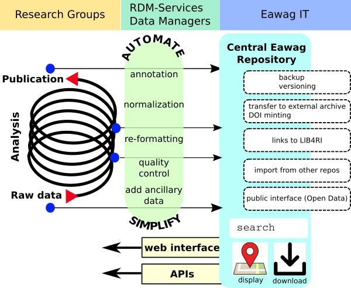

## Eawag Research Data Management Project

### Summary

A central research data repository is being established at Eawag. It
will provide intermediate- and long-term storage for datasets of all
research groups. The software will be tailored to the specific needs
of the researchers at the work group level and is being developed in
close interaction with the users. Besides the repository itself, the
project will also provide guidelines, training and ancillary tools and
services to support researchers with their data-management and
-handling needs.

### Objectives

**1. Provide better support to the scientists to fulfill their data management duties.**

+ Provide a central research storage and archiving facility, including long-term maintenance and support.
+ Support departmental data managers and scientists in organizing, documenting, uploading and accessing data using this facility.

**2. Provide guidance for the robust, person-independent and standards-compliant handling of research data.**

**3. Exploit the collateral benefits of a central data-management platform**

### Guiding Principles

+ **For the scientists, data-management should be a well-defined, simple and quickly executed routine task.**
+ Ensure longevity and interoperability of the software by adhering to established standards.
+ Ensure the practicability of software and processes by continuous user-involvement at every stage.
+ Ensure compatibility with established meta-data standards.
+ Strive for collaboration with related initiatives within the ETH domain and at other research institutions.

### Deliverables 

[Eawag Research Data Platform](#eawag-research-data-platform)  [Metadata Schemes](#metadata-schemes) [RDM Guidelines](#research-data-management-guidelines) [Support Activities](#support-activities)

#### Eawag Research Data Platform (ERDP) [&#8593;](#deliverables)

The project will establish an institution-wide central research data
repository. The repository will be accessible to all Eawag research
groups to

1. store and maintain their own datasets, to
2. search the repository content, and
3. to retrieve datasets

The repository is based on the well-established open-source
data-management software [CKAN](http://ckan.org). While CKAN is being
used by many organizations around the world in an
["OpenData"](https://en.wikipedia.org/wiki/Open_data) context, its use
as a research data management tool requires the development of
custom-tailored extensions that adapt CKAN to the specific needs at
Eawag.

**Features of the ERDP will include:**

+ a batch upload facility
+ customized interfaces for data submission
+ spatial and temporal search across all datasets
+ search for other dataset attributes and global full-text search
+ preview for suitable datasets (as table, map, or graph)
+ ERDP will act as staging area for submitting datasets to other
repositories and for registering a Digital Object Identifier (DOI).

[A link to more technical information to be provided later on GitHub]

#### Metadata Schemes [&#8593;](#deliverables)

Development of a metadata structure that is 

+ compatible, to the degree possible, with international standards,
  such as the [Dublin Core](https://de.wikipedia.org/wiki/Dublin_Core), [RDF](http://www.w3.org/standards/techs/rdf)
  and [DCAT](http://www.w3.org/TR/vocab-dcat/).
+ covers the requirements for all data stored at Eawag,
+ will be extended as needed, and
+ is compliant to the extent possible with common requirements of
  external services, such as [dataCite](https://www.datacite.org/),
  [PANGAEA](http://www.pangaea.de/), or [figshare](http://figshare.com).

#### Research Data Management Guidelines [&#8593;](#deliverables)

The repository roll-out will be accompanied by the development of
data-management guidelines. These guidelines will be developed with
user-input in an iterative fashion and compliance will be supported
by the actual software implementation. The content of the guidelines
presumably specifies the precise meta-data requirements, the types of
datasets that should be submitted to the repository, rules for
write-access to the repository and similar topics.
See the [NERC Data Value Checklist](http://www.nerc.ac.uk/research/sites/data/policy/data-value-checklist.pdf
) as an example of important considerations about which data to archive.

#### Support activities [&#8593;](#deliverables)

Research groups will receive support to streamline their data
submission procedures. This includes case-by-case analysis of current
workflow and requirements, support with structuring, formatting,
annotation, uploading, searching and downloading, the provision of
software to automate such tasks, if applicable, and the cooperative
development of specific meta-data schemes.

### Background

The
[Eawag Guidelines for Good Scientific Practice](http://www.eawag.ch/fileadmin/Domain1/About/Arbeiten/Forschungsumfeld/integritaet_forschung.pdf)
assigns to a research project's PI the responsibility for data
management. In particular that includes ensuring the data's safe
(person-independent) storage and accessibility for a prolonged time
period, coming up with a suitable set of metadata and the respective
annotation of datasets, care against misuse of data by temporary or
external collaborators, and transfer of their own knowledge and data
if they leave Eawag.

In practice, secure storage and retrievability handled individually in
each workgroup is riddled with difficulties. Fluctuating scientific
staff, diverse storage locations, ad-hoc or missing meta-data schemes
are among the reasons for sub-optimal storage of often irreplaceable
and non-reproducible datasets that were produced at substantial cost.

In general, individually carried out proper mid- and long-term storage
and archival of research data requires an undue amount of effort,
time and know-how outside their respective research area from the
scientist in charge, whose time would be much better spent for doing
research.

Therefore, the natural strategy is the establishment of a
professionally managed central data repository. This goes hand in hand
with the establishment of data-management procedures that can be
followed "blindly".

It is also a coming trend that research funders will require a [data management plan](http://data.research.cornell.edu/content/data-management-planning) as a required part of 
research proposals. The Eawag research data management guidelines and platform will be
adapted to support the researchers in fulfilling these requirements. 

### People

Project lead: [Harald von Waldow](http://www.eawag.ch/de/ueberuns/portraet/organisation/mitarbeitende/profile/harald-von-waldow/)   
Steering Group:  [Jochen Bihn](http://www.eawag.ch/de/ueberuns/portraet/organisation/mitarbeitende/profile/jochen-bihn/),
 [Lothar Nunnenmacher](http://www.eawag.ch/de/ueberuns/portraet/organisation/mitarbeitende/profile/lothar-nunnenmacher/),
 [Gabriel Piepke](http://www.eawag.ch/de/ueberuns/portraet/organisation/mitarbeitende/profile/gabriel-piepke/),
 [Peter Reichert](http://www.eawag.ch/de/ueberuns/portraet/organisation/mitarbeitende/profile/peter-reichert/),
 [Raoul Schaffner](http://www.eawag.ch/de/ueberuns/portraet/organisation/mitarbeitende/profile/raoul-schaffner/),
 [Rosi Siber](http://www.eawag.ch/de/ueberuns/portraet/organisation/mitarbeitende/profile/rosi-siber/)
 

### Pilot Phase (March 2016 - December 2016)

During the pilot-phase the platform will become available to all Eawag groups in order to test the system against real-world use-cases and to adapt it to individual requirements. This phase will include individual meetings with research group representatives ("Data Managers") to collect user-feedback and to help refine the system towards a state where it can be routinely used as a standard service. In particular, that will include the development of user specific client-side software to facilitate data preparation and upload. An equally important aspect during that phase is the ability of the users to actively influence the system's development in terms of features, capabilities and modes of access.

Since significant changes to the system will most likely be necessary at that stage, we can neither guarantee the stability of the database structure nor adequate data-security. That means that data delivered to the platform still should be backed up somewhere else. However, we will take care that the work that goes into data-preparation and packaging during the pilot-phase will not be lost and that re-uploading to the final system will be trivial. We will also help with interim-solutions regarding backup, if necessary.

### Co-operation with other projects

We aim to connect with related initiatives within the ETH-domain and Swiss universities. Currently we are in contact with WSL.
With regard to the software, we are part of the global CKAN developer community.

### Time-line

-------------      --------------
**Mar. 2015**      Basic CKAN customization begins.
**Dec. 2015**      Customization based on "real data" begins.
**Mar. 2016**      Start of <a href="" onClick="$('#accordion').accordion('option', 'active', 6); return false;">pilot phase</a>
**Jan. 2017**       Operational phase.
-------------      --------------

